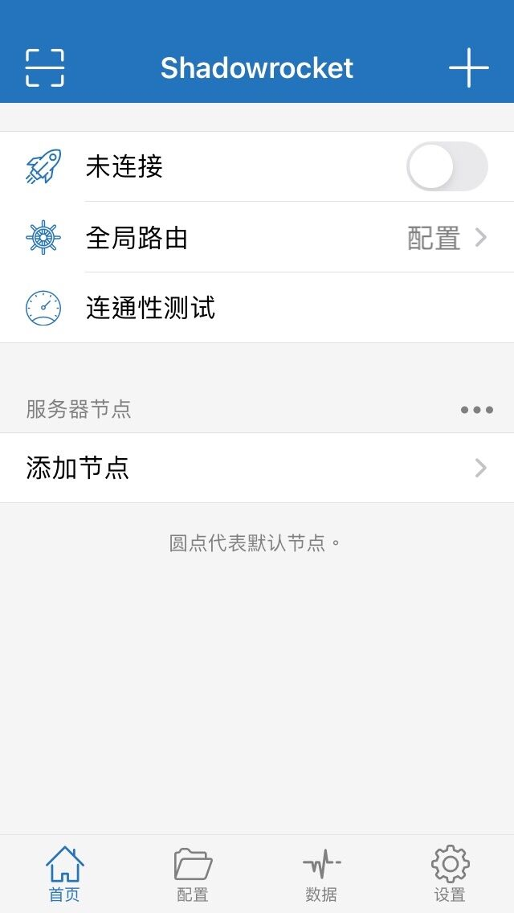
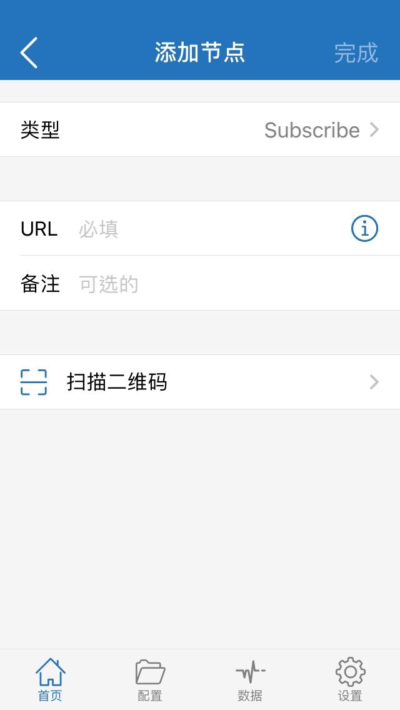
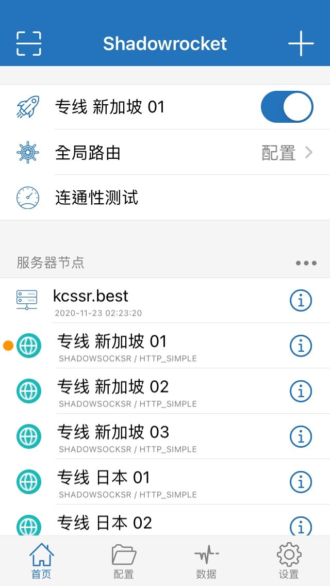

### 简介
Shadowrocket 是 iOS/iPadOS 平台上较早出现的支持 SSR 协议的客户端，坊间称作“小火箭”。

### 下载安装
小火箭在中国大陆区已被下架，请使用外区账号在 AppStore 下载。可以在Google购买独享或共享账号,没有可以联系我微 z283468

### 使用教程
点击右上角加号+

### 添加订阅
前往官网首页 一键订阅 复制订阅链接。 打开 Shadowrocket，点击右上角＋，类型选择 “Subscribe (订阅)”。 粘贴订阅链接至 URL 后，点击右上角 “完成”，Shadowrocket 将从订阅链接获取节点。

 **提示：** 
   
        - 向右滑动订阅链接可手动更新订阅。
        - 在设置中，将 “订阅” 菜单中的 “打开时更新” 与 “后台自动更新” 设置为开启，可让节点列表保持更新。
        - 在设置中，将 “延迟测试方法” 选择为 “CONNECT”，可有效检测节点可用性。

### 最后一步

选择需要使用的节点，打开右上角的开关，在弹出的 “添加 VPN 配置” 中点击“允许”，输入 iOS 设备密码后自动回到 Shadowrocket 即连接成功。

Shadowrocket 默认使用配置模式运行，可以在 “配置” 页面添加你想要的规则，也可在 “全局路由” 中选择其他模式